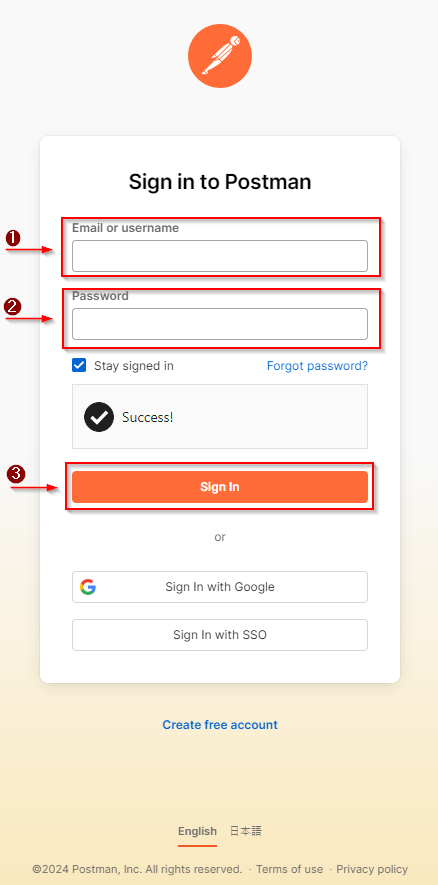
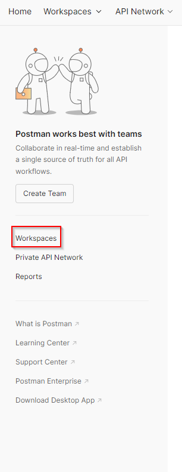
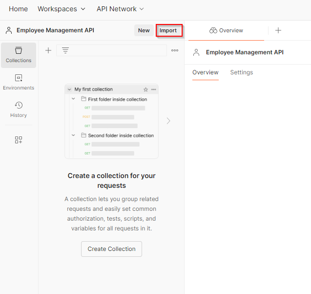
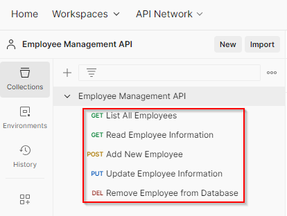

# The Beginner's Guide

## Introduction

The Employee Management API is a tool that allows different software applications to interact with an employee management system. It provides a way to access, manage, and manipulate employee data programmatically, without needing to directly interact with the underlying database or software. It automates tasks, ensures consistency, and enables seamless integration between various business applications.

## Scope

This guide presents information on executing the following Employee Management API service operations:

- Read Employee information
- Delete Employee

## Target Group

This guide is designed to teach basic Employee Management API operations to entry-level users.

## Tools

Postman

## Prerequisites

- Postman Account

## Feature Overview

The Employee Management API operates in three steps:

1. **Request:** An application sends a request to the Employee Management API to perform a specific action.
2. **Processing:** The API processes the request and interacts with the employee management system to execute the action.
3. **Response:** The API returns a response, confirming the success of the action or providing the requested data.

## Service Operation Execution

The following topics present detailed instructions on:

- Postman Account Creation
- Accessing Postman
- Retrieving the information of a specific employee
- Removing the employee from the database
- Importing the Employee Management API

### Postman Account Creation

Postman can be accessed by application or web browser. Choose one of the following options:

[Application Download](https://www.postman.com/downloads/)

[Web Browser](https://identity.getpostman.com/signup?email=)

An account must be created by clicking on ***Create Free Account***.

***Note:***

- Use a company email.
- Create a strong password as defined by the Security Guideline. A strong password should be at least 12 characters long and include a mix of:
  - Uppercase letters (A-Z)
  - Lowercase letters (a-z)
  - Numbers (0-9)
  - Special characters (e.g., !, @, #, $, %, ^, &, *)

After this, validate the company email by clicking the link sent by Postman in the confirmation email. Access to Postman is granted upon completion of this verification.

### Accessing Postman

Follow these steps to access Postman:

1. Launch the Postman application or access its website.
2. Fill in the following fields with credentials:
   - **Email or Username**
   - **Password**
3. Click on ***Sign in***.

### Workspace Creation

Once the login process is finished, the ***Home Page*** loads.

Follow these instructions to create a ***Workspace***:

1. On the left side of the Home Page, click on ***Workspace***. 
2. If no Workspace is available, create one by selecting ***Create Workspace*** on the top-right side of the screen. 
   - **Step 1:** Select the Workspace Template. 
   - **Step 2:** Create a Workspace Name.

***Result:***

The Workspace has been successfully created.

### Read Employee Information

Follow these steps to create a request:
1. With the Workspace created, on the bottom left, click on ***Create Collection***. 
2. Click on ***Add a request***.   

The following image presents the necessary workflow to execute the service operation ***Read Employee Information***:

1. Name the request call ***Read Employee Information***.
2. Select the **GET** method from the dropdown list next to the request URL field.
3. Use the following **base URL**: https://dummy.restapiexample.com/api/v1
4. Use the following **endpoint**: /employee/1
5. Click on the button ***Send***.
6. Postman displays the response from the server in the lower section of the window. Review the response body to see the data returned by the API. In this example, the API retrieves data for the employee with ID number 1.
7. Check the status code to ensure the request was successful.

### Remove Employee from Database

Create another request call for the service operation ***Remove Employee from Database***.

The following image presents the necessary workflow to execute the service operation:

1. Name the request call ***Remove Employee from Database***.
2. Select the **DELETE** method from the dropdown list next to the request URL field.
3. Use the following **base URL**: https://dummy.restapiexample.com/api/v1
4. Use the following **endpoint**: /delete/1
5. Click on the button ***Send***.
6. Postman displays the response from the server in the lower section of the window. Review the response body to see the data returned by the API. In this example, the API deletes the employee with ID number 1.
7. Check the status code to ensure the request was successful.

### Importing Collection

Another option is to download the Employee Management API collection. It simplifies the process since all request calls are already set up.

***Prerequisites***

- Access to the company repository.
- At least one Workspace created. For more information on this, check [Workspace Creation](#workspace-creation).

With the Workspace created, the Collection can be imported. Follow these steps:

1. Download the ***Employee Management API*** collection from the repository.
2. On the top left side, click on ***Import***. 
3. Select the downloaded Collection.
  
***Result:***
All service operations of the Employee Management API are now available in the collection.

